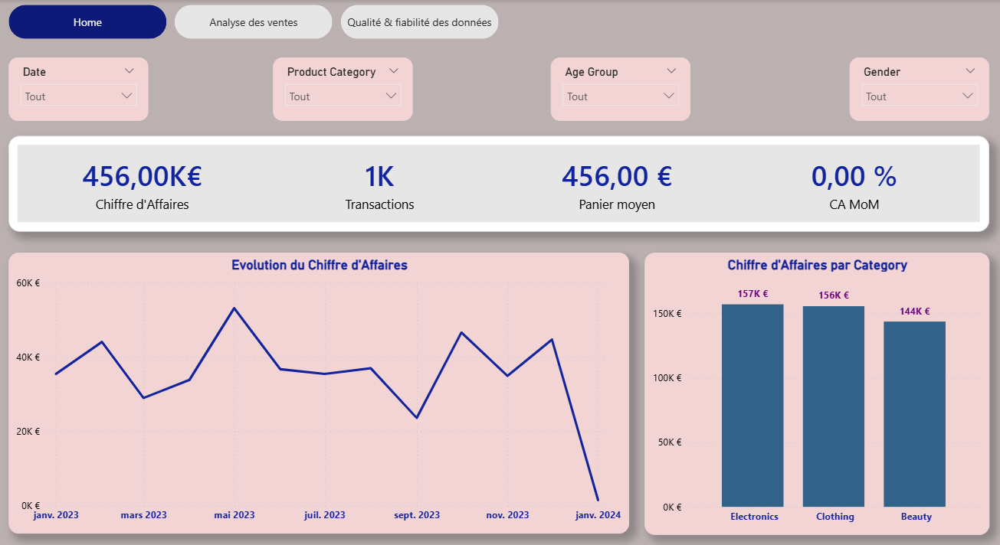
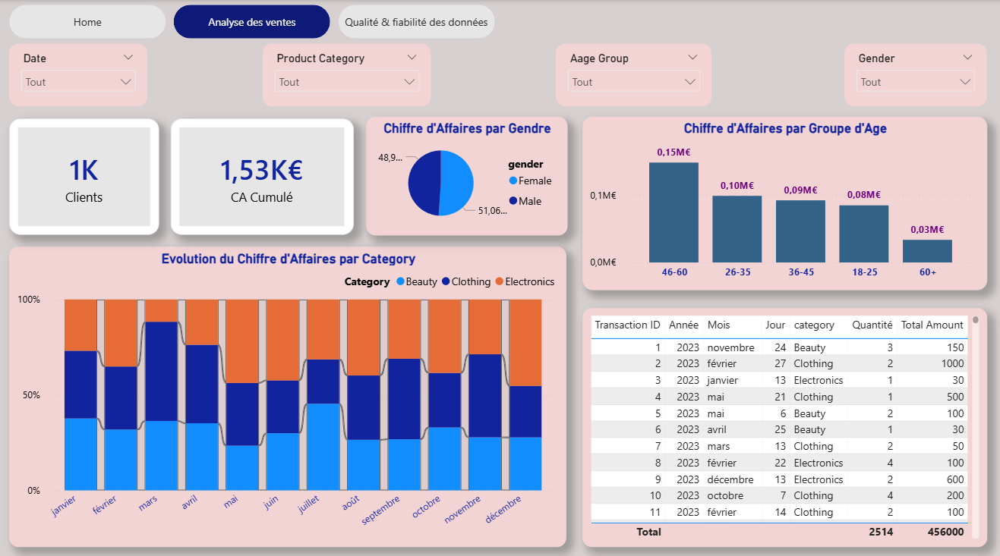
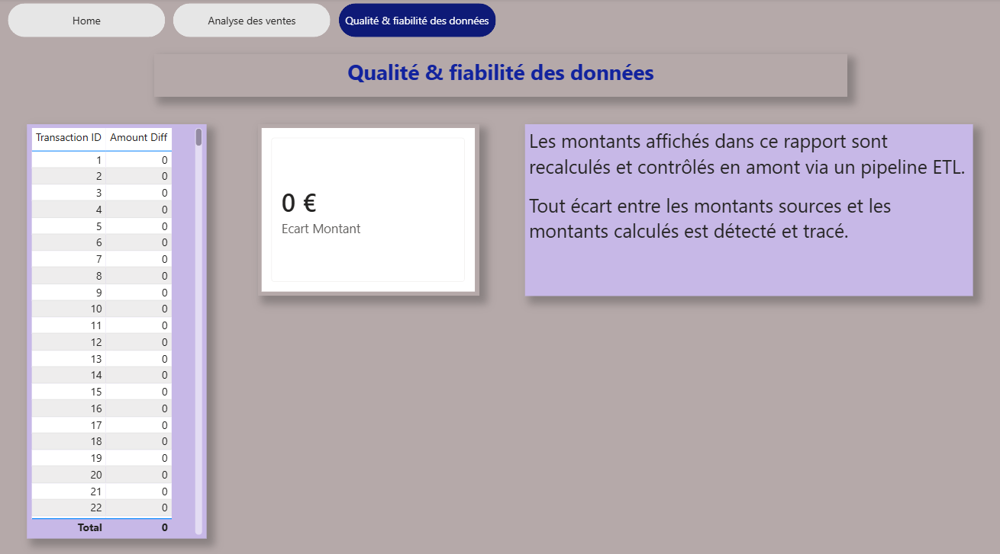

# ETL Retail Sales BI (MySQL & Power BI)

Projet **end-to-end ETL & Business Intelligence** autour de données de ventes Retail :
profiling, nettoyage avec règles de qualité, chargement dans un Data Warehouse MySQL
(modèle en étoile), puis visualisation dans Power BI.

---

## 🎯 Objectif du projet

- Transformer des données de ventes brutes (CSV) en données fiables
- Appliquer des **règles de Data Quality** (contrôles, rejets)
- Construire un **Data Warehouse MySQL** en schéma étoile
- Créer un **dashboard Power BI orienté décision**

---

## 🧩 Stack technique

- Python (Pandas, NumPy)
- MySQL
- SQLAlchemy
- Power BI
- Git / GitHub
- dotenv (.env)

---
## 📁 Structure du projet
```
ETL_RETAIL_BI/
│
├── dashboardPBX/
│   └── retail_dashboard.pbix
│
├── data/
│   ├── raw/                 # Données brutes
│   ├── processed/           # Données nettoyées + rejetées
│   └── warehouse/           # (optionnel / évolution)
│
├── scripts/
│   ├── 01_profiling.py      # Analyse exploratoire & qualité
│   ├── 02_cleaning.py       # Nettoyage + règles métier
│   └── 03_load_mysql_star.py# Chargement MySQL (schéma étoile)
│
├── assets/
│   └── screenshots/         # Captures du dashboard
│
└── .env
```

---

## 🔍 Étape 1 – Data Profiling

Script : `01_profiling.py`

Analyses réalisées :
- aperçu des données
- types des variables
- valeurs manquantes
- doublons globaux
- doublons sur `Transaction ID`

🎯 Objectif : comprendre la structure et les anomalies avant traitement.

---

## 🧹 Étape 2 – Nettoyage & Data Quality

Script : `02_cleaning.py`

### Règles appliquées
- Date valide
- Quantité > 0
- Prix unitaire > 0
- Âge compris entre 10 et 100
- Customer ID non vide
- Cohérence du montant total (recalcul Quantity × Price)

### Résultats
- `sales_clean.csv` → données exploitables
- `sales_rejected.csv` → lignes rejetées avec **raison explicite**

📌 Approche orientée **qualité des données**.

---

## 🏗️ Étape 3 – Data Warehouse MySQL

Script : `03_load_mysql_star.py`

### Base
- `retail_dw`

### Modèle en étoile

#### Dimensions
- `dim_customer` : âge, genre, groupe d’âge
- `dim_product` : catégorie produit
- `dim_date` : date, mois, trimestre, année

#### Table de faits
- `fact_sales` : transactions, quantités, montants

Relations :
- dimensions (1) → fact_sales (*)

---

## ⚙️ Configuration

Créer un fichier `.env` :

```env
MYSQL_HOST=localhost
MYSQL_PORT=3306
MYSQL_USER=root
MYSQL_PASSWORD=********
MYSQL_DB=retail_dw
```
⚠️ Le fichier .env n’est pas versionné.

## ▶️ Exécution du pipeline ETL
```
python scripts/01_profiling.py
python scripts/02_cleaning.py
python scripts/03_load_mysql_star.py
```
Logs attendus :
```
=== LOAD OK (MySQL) ===
dim_customer : xxx
dim_product  : xxx
dim_date     : xxx
fact_sales   : xxx
```
## 📊 Dashboard Power BI

Le rapport Power BI est structuré en 3 pages principales.

## 📸 Aperçu du Dashboard Power BI

### 🏠 Page d’accueil


### 📊 Analyse des ventes

🎯 Objectif : identifier les leviers de performance commerciale.
### 🛡️ Qualité & fiabilité des données



## 🔜 Améliorations possibles

Chargement incrémental

Orchestration (Airflow / Prefect)

Publication Power BI Service + refresh planifié
